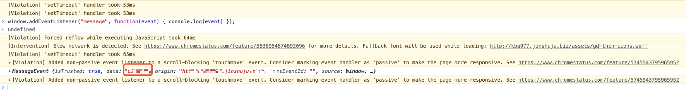

# 金数据SDK文档 (jinshuju.net)

**本文档适用于您的金数据账号位于 jinshuju.net，如有疑问请联系客服或者销售**

金数据提供SDK可对表单进行创建和编辑操作。

## SDK 应用场景举例

### 1. 将金数据创建和编辑表单的功能无缝进入企业当前系统

如果企业已有Web站点，可将金数据SDK嵌入到企业页面中。 通过在你的企业系统中点击按钮等事件触发新建表单或编辑已在金数据中已存在的表单。SDK提供的新建和编辑表单页面中不会显示金数据的账号信息和退出金数据登录按钮，并且新建的表单以及表单产生的数据依然存储在金数据中，你可以随时使用。

### 2. 静默登录

如果企业中已拥有用户体系，金数据可以根据SDK请求中携带的企业用户ID自动登陆系统，静默登陆后可直接进行创建和编辑表单的操作。

### 3. 灵活控制 SDK 可使用的字段范围

企业中也可以灵活控制SDK中创建和编辑表单可使用的字段范围。金数据企业版提供了 43 个表单字段。当企业调用SDK时，可定义SDK中不可使用的字段，让不同的企业用户可以有不同的字段权限。

## SDK 使用指南

### 1. 向金数据申请初始化 SDK

初始化脚本示例如下:

```javascript
<script type='text/javascript'>
  (function (w, d, t, s, n) {
    w[n] = w[n] || function () { (w[n].q = w[n].q || []).push(arguments); };
    var a, x = d.getElementsByTagName(t)[0];
    if (d.getElementById(n)) {return;}
    a = document.createElement(t); a.id = n; a.type = 'text/javascript'; a.async = true; a.src = s;
    x.parentNode.insertBefore(a, x);
  })(window, document, 'script', 'https://www.jinshuju.net/sdk.js?appid=<your_sdk_appid>&v=1.0.0', 'gdsdk');
<script>
```

### 2. 创建新表单

你可以在数据属性中使用 `data-role="gd-sdk"`，或直接调用 `gdsdk.createForm()` 方法来创建一个新表单。示例如下：

```html
<button data-role="gd-sdk">创建新表单</button>
```

```javascript
gdsdk.createForm()
```

### 3. 编辑表单

你可以在数据属性中使用`data-role="gd-sdk"`和`data-form="<form_token>"`，或直接调用`gdsdk.editForm("<form_token>")`方法来编辑表单。示例如下：

```html
<button data-role="gd-sdk" data-form="Dv6jVf">修改</button>
```

```javascript
gdsdk.editForm("Dv6jVf")
```

### 4. 表单规则

你可以通过调用`gdsdk.formRule("<form_token>")`方法来编辑表单规则。示例如下

```javascript
gdsdk.formRule("Dv6jVf")
```

### 5. 保存表单

在iframe中表单保存成功后, 会抛出一个事件, 其中 data 是该表单的 token, 可后面用 v1 API 获取其他信息


### 6. 控制表单显示和隐藏的字段

你可以配置在引用的SDK中显示和隐藏的字段列表。配置后的字段将不出现在新建和编辑的表单中。如only和except同时使用，系统会取两者交集显示在SDK中。示例如下：

```javascript
gdsdk.ready = function() {
  gdsdk.config({
    fields: {only: ['TextField', 'TextArea', 'RadioButton', 'CheckBox'],
             except: ['NpsField', 'DropDown', 'NameField']}
 });
};
```

可配置的字段列表如下：

```javascript
['TextField','TextArea','RadioButton','CheckBox','ImageRadioButton','ImageCheckBox','DropDown','CascadeDropDown','NumberField','AttachmentField','TimeField','DateField','PageBreak','SectionBreak','LinkField','GeoField','MultipleBlanksField','GoodsField','BasicGoodsField','NameField','MobileField','EmailField','TelephoneField','AddressField','MatrixField','LikertField','TableField','FormAssociation','RatingField','NpsField','SortField','ESignatureField','FormulaField','ReservationField','Divider','StyledText','ImageText','Carousel','Timer','ImageGroup','WidgetMap','WidgetContact','WidgetVideo']
```

### 7. 控制 SDK 打开窗口在浏览器新tab中还是新窗口或者inline iframe

你可以配置在引用的SDK中打开窗口在浏览器新tab中还是新窗口或者 iframe。示例如下：

```javascript
gdsdk.ready = function() {
  gdsdk.config({
      open: 'tab'
  });
};
```

可配置选项如下：

```javascript
'tab', 'window', 'inline'
```

备注：当使用 `inline` 时，需要提供一个页面上的 div的 id(默认为: `gd_sdk_container`) 作为容器，使得 sdk的页面嵌入, 例如

```javascript
gdsdk.ready = function() {
  gdsdk.config({
    open: 'inline',
    containerId: 'gd_sdk_container',
  });
};
```

### 8. 支持 JWT 登录

SDK中支持JWT登录用户。JWT 中需包含请求登录用户的uid，其直接登录金数据系统。 示例如下：

```html
<button data-role="gd-sdk" data-jwt="<jwt>" data-form="Dv6jVf">修改</button>
```

```javascript
gdsdk.createForm("<jwt>")
gdsdk.editForm("<form_token>", "<jwt>")
gdsdk.formRule("<form_token>", "<jwt>")
```